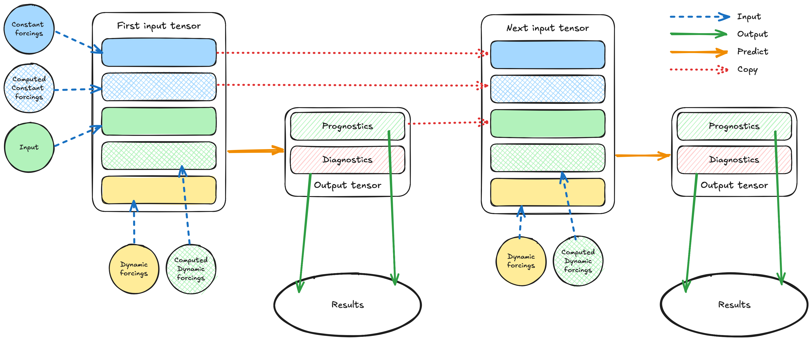

.. _overview:

##########
 Overview
##########

.. _data-flow:

   Flow of data in inference.

The schema above is a high-level overview of the data flow in the
inference process (click on the image for a larger version).

Several key concepts are introduced:

-  Input:
-  Prognostic variables:
-  Diagnostic variables:
-  Output:
-  Constant forcings:
-  Dynamic forcings:
-  Computed constants:
-  Computed forcings:
